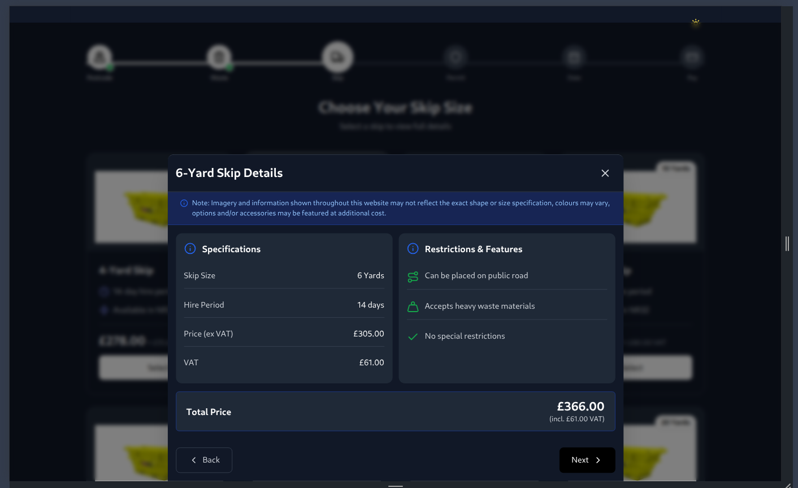
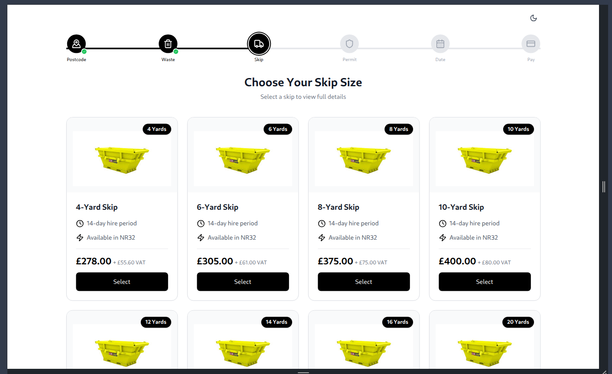
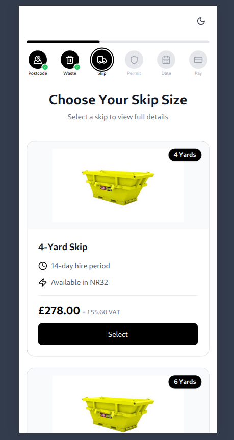
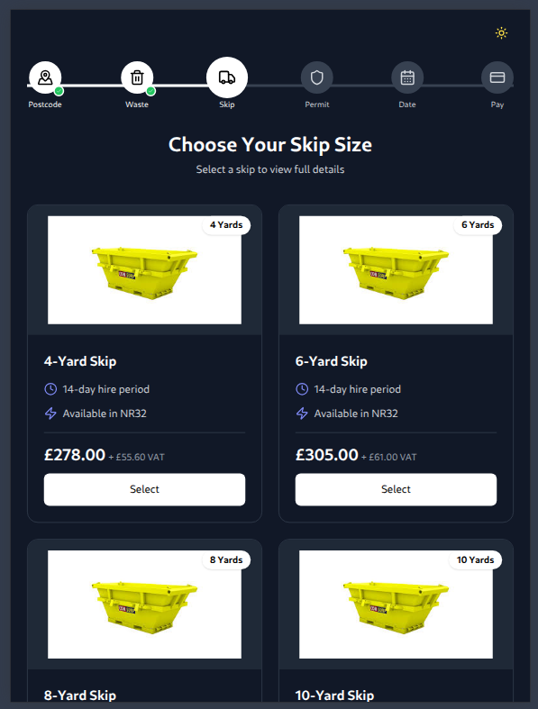
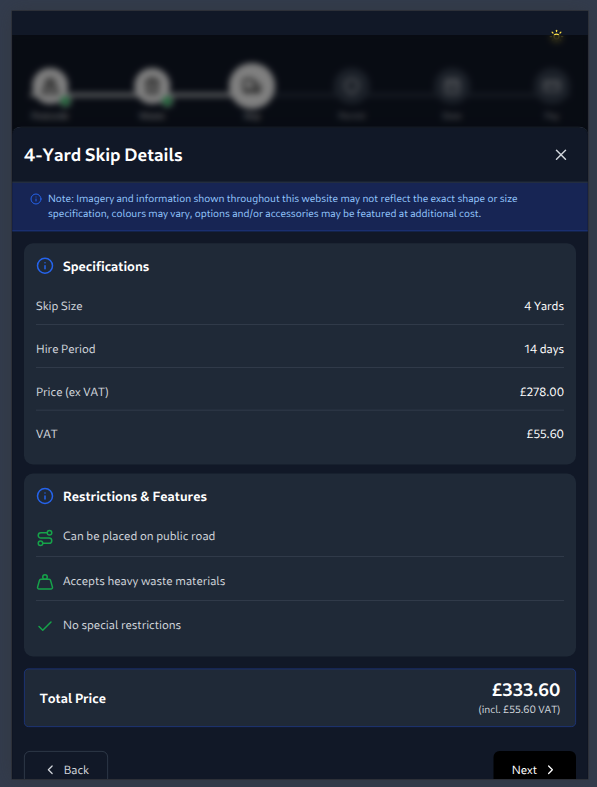

# 🚛 Skip Hire Booking Interface ✨

A modern, responsive React application for selecting and booking skips, with focus on clean code, maintainability, and excellent UI/UX.



## 🔥 Features

- 🌐 **Responsive Design**: Fully optimized for mobile, tablet, and desktop
- 🌗 **Dark/Light Mode**: Smooth theme switching with system preference detection
- 🎨 **Interactive UI**: Animated progress bar and skip selection cards
- 📊 **Data-Driven**: Real-time skip data from API endpoint
- ♿ **Accessible**: WCAG compliant with proper contrast ratios
- 🛡️ **Type Safe**: Built with TypeScript for better developer experience

## 🖥️ Screenshots

### Desktop
<div align="center">
  
  
</div>

### Mobile
<div align="center">
  
  
</div>

### Tablet
<div align="center">
  
  
</div>

## 🛠️ Tech Stack

- ⚛️ React 18 with Hooks
- 📜 TypeScript
- 🎨 Tailwind CSS
- ✨ Lucide Icons
- 🧩 Context API (State Management)
- ⚡ Vite (Build Tool)

## 🚀 Live Demo

Check out the live demo here: [Link](https://the-wild-oasis-website-theta-three.vercel.app/)

## 📦 Installation

1. Clone the repository:
   ```bash
   git git@github.com:codehass/skip-selection-page-.git
   cd skip-selection-page
   ```

2. Install dependencies::
   ```bash 
   pnpm install
   ```

3. Run the development server::
   ```bash
   pnpm run dev
   ```
## Code Structure
<pre><code> /src 
├──📂 components 
│ ├── ProgressBar.tsx # Step progress indicator 
│ ├── SkipCard.tsx # Individual skip display card 
│ ├── SkipDetails.tsx # Detailed skip information panel 
│ ├── ThemeToggle.tsx # Dark/light mode switch 
│ └── Skeleton.tsx # Loading state component 
├──📂 context 
│ └── ThemeContext.tsx # Dark/light mode state management 
├──📂 types 
│ └── skip.ts # Type definitions 
├── App.tsx # Main application component 
└── main.tsx # Application entry point 
</code></pre>

## 🤝 Contributing <a name="contributing"></a>

Contributions, issues, and feature requests are welcome!

Feel free to check the [issues page](https://github.com/codehass/skip-selection-page-/issues).

## ⭐️ Show your support <a name="support"></a>

Join us in supporting our project to improve cabin management in hotels! Your help makes a big difference in making stays smoother and guests happier. Let's work together to bring positive change to the hospitality industry!

## 📝 License <a name="license"></a>

This project is [MIT](./MIT.md) licensed.